# DeepSeek V4 技术学习手册

本手册基于 DeepSeek V4 官方技术报告及相关公开资料整理，目标不是复述论文，而是把其中几项最值得学习的新技术讲清楚，方便快速建立整体理解。

说明：

- 核心结论和官方表述，主要来自 DeepSeek V4 技术报告（2026-04-24 发布预览版）及官方 Hugging Face 模型卡。
- `CSA/HCA`、`mHC`、`Muon` 的原理与工程细节，结合了官方技术报告与对应公开论文整理。
- `FP4` 与 `MoE` 改进直接来自 V4 技术报告中的训练与推理效率章节。
- `Engram` 相关介绍基于 DeepSeek 同期发表的同名研究论文，技术报告中未明确披露其是否已完整集成进 V4，此处作为相关前沿技术一并列出供学习参考。

## 先看结论

DeepSeek V4 这次最重要的变化，不只是"参数更大"或者"上下文更长"，而是它围绕一个核心目标做了系统性改造：

> 如何把模型推向百万级上下文，同时尽量不让训练和推理成本失控。

围绕这个目标，DeepSeek V4 主要做了八件事：

1. 用 `CSA + HCA` 组成混合注意力，把长上下文的注意力成本和 KV Cache 压下来。
2. 用 `mHC` 重做跨层信息传递，让更深、更复杂的残差连接仍然稳定。
3. 用 `Muon` 优化器提升训练阶段的收敛速度和稳定性。
4. 用"两阶段后训练"把不同领域专家能力先练出来，再统一蒸馏回一个模型。
5. 用 `FP4` 量化感知训练进一步压缩专家权重和索引器的内存与带宽占用。
6. 用一系列 `MoE` 结构改进（Hash-routed 早期层、序列级负载均衡等）提升稀疏激活的效率与稳定性。
7. 同期研究提出 `Engram` 条件记忆，尝试用 O(1) 哈希查表来卸载静态知识检索，缓解 MoE 的无效计算。
8. 用 `DSec` 弹性沙盒系统，为大规模 Agent 强化学习提供数十万个并发执行环境，支撑工具调用、代码执行与多轮交互的训练与评测。

## 模型概览

| 指标 | DeepSeek-V4-Pro | DeepSeek-V4-Flash |
|------|-----------------|-------------------|
| 总参数量 | 1.6 T (MoE) | 284 B (MoE) |
| 每 token 激活参数量 | ~49 B | ~13 B |
| 上下文窗口 | 1M tokens | 1M tokens |
| 预训练数据量 | 33 T tokens | 32 T tokens |
| 1M 上下文单 token FLOPs (相对 V3.2) | ~27% | ~10% |
| 1M 上下文 KV Cache (相对 V3.2) | ~10% | ~7% |

## 总览图

```mermaid
flowchart TD
    A["DeepSeek V4 核心目标<br/>百万级上下文 + 更高训练/推理效率"] --> B["架构层：Hybrid Attention"]
    A --> C["连接层：mHC"]
    A --> D["优化层：Muon"]
    A --> E["能力整合层：Two-stage Post-training"]
    A --> F["压缩层：FP4 Quantization"]
    A --> G["稀疏层：MoE Improvements"]
    A --> H["记忆层：Engram Conditional Memory<br/>(同期研究，集成状态待官方确认)"]
    A --> I["基础设施层：DSec 弹性沙盒<br/>支撑 Agent 强化学习"]

    B --> B1["CSA：4:1 压缩 + top-k 稀疏选择"]
    B --> B2["HCA：128:1 重压缩 + 稠密全局注意力"]

    C --> C1["Sinkhorn-Knopp 投影到双随机矩阵流形"]
    C --> C2["谱范数 <= 1，防止信号爆炸"]

    D --> D1["Newton-Schulz 矩阵正交化更新"]
    D --> D2["更快收敛 + 更稳大模型训练"]

    E --> E1["先独立培养领域专家"]
    E --> E2["再做 on-policy distillation 统一模型"]

    F --> F1["MoE 专家权重与索引器 QK 用 FP4"]
    F --> F2["无损吸收到 FP8，pipeline 无需改动"]

    G --> G1["Hash-routed MoE 替代早期 Dense FFN"]
    G --> G2["Sqrt(Softplus) 激活 + 序列级负载均衡"]

    H --> H1["多粒度 N-Gram 哈希查表"]
    H --> H2["O(1) 静态知识检索，可异步预取"]

    I --> I1["统一四种异构底座<br/>函数/容器/MicroVM/VM"]
    I --> I2["全局轨迹日志 + Fast-forward 断点续训"]
```

## 目录

- [01. 混合注意力：CSA 与 HCA](./01-hybrid-attention-csa-hca.md)
- [02. mHC：流形约束超连接](./02-mhc.md)
- [03. Muon：面向隐藏层矩阵参数的优化器](./03-muon.md)
- [04. 两阶段后训练：专家培养与 On-Policy Distillation](./04-post-training.md)
- [05. FP4 量化感知训练](./05-fp4-quantization.md)
- [06. MoE 架构改进](./06-moe-architecture.md)
- [07. Engram 条件记忆（同期研究）](./07-engram-memory.md)
- [08. DSec：面向大规模 Agent 训练的弹性计算沙盒](./08-dsec-sandbox.md)

## 建议阅读顺序

如果你是第一次看这套技术，推荐这样读：

1. 先读 `01`，理解 DeepSeek V4 为什么能把上下文做到 `1M tokens`。
2. 再读 `02`，理解它为什么能在更复杂连接方式下保持训练稳定。
3. 接着读 `03`，理解它怎样让大规模训练更快收敛。
4. 读 `04`，理解它怎样把"多领域专家能力"汇总成一个统一模型。
5. 读 `05`，理解它怎么用 FP4 进一步压低成本。
6. 读 `06`，理解 MoE 结构本身的演进细节。
7. 读 `07`，了解 Engram 这个相关的前沿记忆机制（注意集成状态）。
8. 读 `08`，理解支撑 Agent 能力落地的训练基础设施 DSec。

## 一个记忆框架

可以用下面这句来记：

> `CSA/HCA` 解决"看得远还不能太贵"，`mHC` 解决"层数更深也别炸"，`Muon` 解决"训练得更快更稳"，两阶段后训练解决"专家能力如何收回来变成统一能力"，`FP4` 解决"存储和带宽再砍一刀"，MoE 改进解决"稀疏激活本身如何更高效"，`Engram` 探索"静态知识能不能用查表代替计算"，`DSec` 解决"十万个 Agent 同时试错的工程底座"。

## 参考资料

- DeepSeek V4 官方模型卡：[deepseek-ai/DeepSeek-V4-Pro](https://huggingface.co/deepseek-ai/DeepSeek-V4-Pro)
- DeepSeek V4 技术报告 PDF：HuggingFace Repo 内 `DeepSeek_V4.pdf`
- mHC 论文页：[mHC: Manifold-Constrained Hyper-Connections](https://arxiv.org/abs/2512.24880)
- Muon 原始说明：[Muon: An optimizer for hidden layers of neural networks](https://kellerjordan.github.io/posts/muon/)
- FP4 训练相关：[Optimizing Large Language Model Training Using FP4 Quantization](https://arxiv.org/html/2501.17116v1)
- Engram 研究论文："Conditional Memory via Scalable Lookup: A New Axis of Sparsity for Large Language Models"
- DSec 相关解读：[DeepSeek V4 Launches Advanced Elastic Computing Sandbox DSec](https://phemex.com/news/article/deepseek-v4-launches-advanced-elastic-computing-sandbox-dsec-75630)
