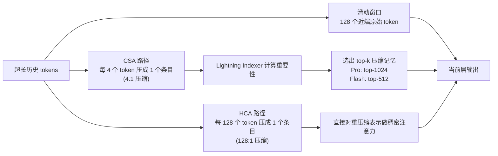
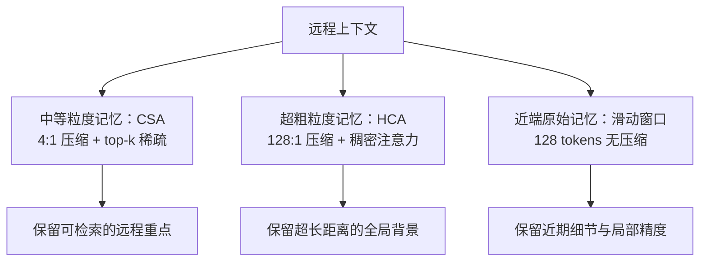

# 01. 混合注意力：CSA 与 HCA

## 这项技术想解决什么问题

传统 Transformer 的注意力在上下文很长时会越来越贵，主要贵在两件事：

- 计算量会随上下文增长而迅速上升。
- `KV Cache` 会越来越大，推理时非常吃显存。

DeepSeek V4 的官方数据是：在 `1M tokens` 场景下，通过 `CSA + HCA` 混合注意力：

| 指标 | V4-Pro 相对 V3.2 | V4-Flash 相对 V3.2 |
|------|------------------|--------------------|
| 单 token 推理 FLOPs | **27%** | **10%** |
| KV Cache 大小 | **10%** | **7%** |

所以它的核心不是"让每个 token 都完整看全部历史"，而是：

> 让模型对不同历史信息采用不同精度的记忆和访问方式。

## 一句话理解

`CSA` 负责"压缩后再挑重点看"，`HCA` 负责"极限压缩后保留低成本全局背景"。

## 工作直觉

可以把长上下文想成一本超长资料：

- 最近几页最重要，要原样细看（滑动窗口）。
- 较远但可能相关的段落，可以先压缩成摘要，再挑重点回看（CSA）。
- 更远的超长历史，不可能逐字重读，只能保留一个更粗粒度的全局印象（HCA）。

DeepSeek V4 就是把这三种访问方式装进同一个注意力系统里。

## 结构图

## CSA：压缩稀疏注意力

### 它怎么做

根据 V4 技术报告，`CSA` 的流程大致是：

1. **压缩**：先把每 **4 个 token** 的 `KV` 压成一个更粗的表示（4:1 序列维度压缩）。
2. **索引**：用一个 `Lightning Indexer` 给这些压缩表示打分。
3. **稀疏选择**：只选择最相关的 `top-k` 压缩条目参与核心注意力。
   - V4-Pro：`top-1024`
   - V4-Flash：`top-512`
4. **局部窗口并行**：同时保留一个 **128 tokens** 的滑动窗口，用于 uncompressed 的局部精细注意力。

这相当于：

- 先把历史做"分段摘要"。
- 再从摘要里挑最值得回看的几段。

### 它带来的好处

- 不是所有远距历史都参加注意力计算，成本明显下降。
- 远处信息不是直接丢掉，而是先压缩、再选择，比简单截断更稳。
- 稀疏选择让模型能把计算预算集中在更相关的远程上下文上。

### 它的代价

- 如果压缩器做得不好，段内细节会丢失。
- 如果索引器判断失误，重要历史可能选不进 `top-k`。

所以 `CSA` 其实是在做一个工程权衡：

> 用"先压缩、再检索"的方式，换取长上下文下可接受的推理成本。

## HCA：重度压缩注意力

### 它怎么做

`HCA` 比 `CSA` 更激进：

- 每 **128 个 token** 压成一个条目（128:1 压缩）。
- 和 `CSA` 不同，`HCA` **不做稀疏 top-k 选择**，而是在这些"超粗粒度记忆"上做**稠密注意力**。

### 直觉上像什么

如果说 `CSA` 是"按章节做摘要，再挑重点章节"，那 `HCA` 更像是"给整本书做目录级概览"。

它保留的不是细节，而是：

- 整体主题
- 全局背景
- 超长跨度的信息轮廓

### 它带来的好处

- 计算和缓存成本进一步下降。
- 即使上下文拉到百万级，模型仍然保留某种全局感知。
- 适合承接"非常远但也许有用"的背景信息。

## 混合层交错策略

CSA 和 HCA 不是每层都用同一个，而是**交错排列**：

- **V4-Pro**：前两层用 `HCA`，后续层交错 CSA/HCA。
- **V4-Flash**：前两层用**纯滑动窗口注意力**，后续层交错 CSA/HCA。

这样设计的原因是：

- 浅层更需要快速建立全局上下文感知（HCA 便宜且全局）。
- 深层需要更精确的远程检索能力（CSA 提供可选择的压缩细节）。

## 为什么要把 CSA 和 HCA 组合起来

单独使用其中一个都不够理想：

- 只有 `CSA`：虽然比全注意力便宜，但面对百万级上下文，成本可能还是偏高。
- 只有 `HCA`：虽然特别省，但信息太粗，容易丢掉关键远程细节。

因此更合理的做法是分层分工：

这其实是一种**多尺度记忆系统**，很像数据库里的冷热分层存储：

| 层级 | 压缩比 | 访问方式 | 类比 |
|------|--------|----------|------|
| 滑动窗口 | 1:1 | 全量稠密 | 内存 |
| CSA | 4:1 | 稀疏选择 | SSD |
| HCA | 128:1 | 全量稠密（在压缩空间） | 归档存储 |

## DeepSeek V4 的关键价值

从学习角度看，这项技术最值得记住的是三点：

### 1. 它不是"更长上下文"这么简单

DeepSeek V4 真正的创新点不是把上下文窗口参数写成 `1M`，而是提出一种更便宜的注意力访问层级，让这个 `1M` 变得**实际可用**。

### 2. 它把注意力变成了"分层存储"

传统注意力更像"所有历史都用同一种精度保存"。
DeepSeek V4 更像是：

- 近期信息高精度存储
- 中程信息压缩后可检索
- 超远信息重压缩后保留轮廓

### 3. 它说明长上下文问题本质上是系统问题

要支持百万级上下文，不只是模型结构问题，也是**缓存组织、检索策略、压缩方式**共同作用的系统设计问题。

## 你可以这样判断它适合什么任务

更适合：

- 长文档问答
- 多文件代码仓阅读
- 长链路 agent 任务
- 需要跨很多轮保留背景的工作流

可能仍然有挑战：

- 需要逐 token 精确回忆极远位置细节的任务
- 压缩失真会显著伤害结果的任务

## 小结

`CSA/HCA` 的本质可以概括成一句话：

> 不是让模型把所有远程历史都"原样记住"，而是让模型以不同压缩率保存不同距离的信息，再按成本和重要性去访问它们。

这就是 DeepSeek V4 能把长上下文推到百万级，同时又尽量控制推理成本的关键。

## 参考资料

- 官方模型卡：[DeepSeek-V4-Pro](https://huggingface.co/deepseek-ai/DeepSeek-V4-Pro)
- V4 技术报告：`DeepSeek_V4.pdf`（HuggingFace repo 内）
- 公开技术摘要：[HyperAI - DeepSeek-V4](https://hyper.ai/cn/papers/DeepSeek-V4)

## 补充说明

关于 `CSA` 中 `Lightning Indexer` 的具体打分机制、`HCA` 的压缩器结构，以及异构 `KV Cache` 的内存布局，公开可见资料目前主要来自技术报告摘要页；本文在这些细节上做的是"基于官方描述的教学性整理"，不是逐段翻译原论文。
