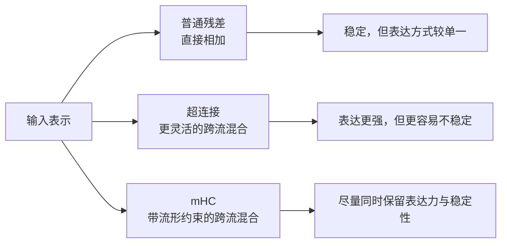
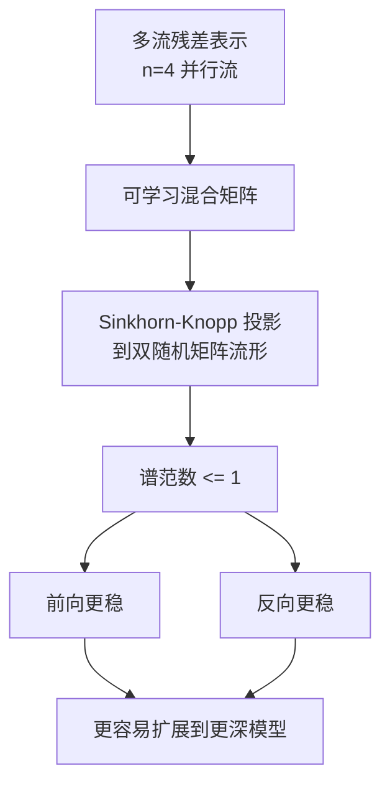

# 02. mHC：流形约束超连接

## 先从残差连接讲起

大模型之所以能堆很多层，一个核心基础就是残差连接：

```text
x_{l+1} = x_l + F(x_l)
```

它的意义很大，因为它给网络保留了一条近似"恒等映射"的通路。
这条通路能帮助：

- 信息更容易跨层传递
- 梯度更容易反传
- 深层网络更稳定

但问题是，随着模型越来越深、结构越来越复杂，简单的"原样相加"不一定总够用。研究者于是会尝试更丰富的跨层混合方式，也就是更强的 `Hyper-Connections`。

## 为什么普通超连接会带来风险

超连接的思路是：不要只让每层输入和输出做简单相加，而是允许更灵活的跨流、跨层混合。

这样做通常能增强表达力，但也会带来副作用：

- 恒等映射性质被破坏
- 前向信号可能被放大或扭曲
- 反向梯度也更容易不稳定
- 训练越深越难 scale

DeepSeek 的实验数据显示：一个 **27B 参数模型** 如果使用**无约束的 Hyper-Connections**，前向信号放大可能超过 **~3000 倍**，直接导致训练发散、loss spike、梯度爆炸。

`mHC` 想解决的就是这个问题：

> 怎样在"连接更灵活"的同时，尽量保留残差网络稳定训练的好处。

## 一句话理解

`mHC` 的核心思想是：让连接矩阵不是随便学，而是被约束在一个更稳定的数学空间里——**双随机矩阵流形（Birkhoff Polytope）**。

## 什么叫 doubly stochastic matrix

你可以先不纠结严格定义，只抓住两个性质：

- 每一行加起来是 `1`
- 每一列加起来也是 `1`
- 所有元素非负

这意味着它像一种"守恒式混合"：

- 信息会重新分配
- 但不会被任意放大

从直觉上看，这种约束有点像给网络的跨层混合加了护栏。

更关键的是：双随机矩阵的**谱范数（spectral norm）<= 1**，这从数学上保证了信号不会层层爆炸。

## 图解：普通残差、超连接、mHC 的区别



## mHC 的工作方式

教学化地理解，可以分成三步：

1. 先把残差流扩展成 **n=4 个** 可交互的并行通道/流。
2. 用一个可学习矩阵去决定这些流之间如何混合。
3. 但这个矩阵不能无约束增长，而是通过 **Sinkhorn-Knopp 算法** 投影到双随机矩阵流形上。

### Sinkhorn-Knopp 投影（概念实现）

```python
def sinkhorn_projection(H, iterations=20):
    M = torch.exp(H)  # 保证正性
    for _ in range(iterations):
        M = M / M.sum(dim=1, keepdim=True)  # 行归一化
        M = M / M.sum(dim=0, keepdim=True)  # 列归一化
    return M  # 双随机矩阵：每行每列和都为 1
```

V4 中使用了 **t_max = 20** 次迭代，在精度和计算开销之间取得平衡。

公开资料把这个约束空间描述为"双随机矩阵流形"，这带来两个重要效果：

- 混合仍然足够灵活，不是只能做恒等映射。
- 但这种灵活性不会无限制地破坏数值稳定性。

## 为什么"谱范数不超过 1"很重要

如果一个映射矩阵能随便把向量放大很多倍，那么：

- 前向时，表示可能越来越爆
- 反向时，梯度也可能越来越不稳定

而当谱范数被约束在 `1` 附近时，可以把它理解成：

- 最强方向上的放大倍数被控制住了
- 深层堆叠时更不容易层层累积成灾难
- 矩阵的连乘积仍然是双随机的，**任意深度都保持封闭性**

这就是 `mHC` 为什么特别强调训练稳定性。

## 图解：mHC 的稳定性直觉



## 工程优化：把开销压到 6.7%

原始 Sinkhorn-Knopp 会带来不可接受的训练开销。DeepSeek 做了大量工程优化：

| 优化手段 | 作用 |
|---------|------|
| **Kernel Fusion (TileLang)** | 把 RMSNorm、投影、Sinkhorn 迭代融合成统一 CUDA kernel |
| **混合精度** | 计算用 FP8/bfloat16，敏感归一化步骤用 FP32 |
| **选择性重计算** | 反向时重算中间量来省显存 |
| **DualPipe 通信重叠** | 分布式训练中隐藏通信延迟 |
| **自定义反向 kernel** | 在芯片上重算 Sinkhorn 迭代，避免遍历完整迭代图 |

最终效果：相比无约束 HC，mHC 仅增加 **~6.7%** 的训练时间（n=4 时）。

## DeepSeek V4 为什么需要它

DeepSeek V4 的目标是把模型做得更强，同时还要兼顾长上下文和大规模训练效率。
在这种背景下，单纯"加大模型"通常不够，跨层信息传播也要一起升级。

`mHC` 在这里的作用，可以理解成：

- 它不是直接提升上下文长度的模块。
- 它是在更底层修补"深层网络如何稳定传信息"这个问题。
- 因为层间信号传播更稳，模型更容易支撑更复杂的整体架构升级（CSA/HCA、MoE 等）。

所以 `mHC` 更像是底层建筑结构，而不是顶层功能按钮。

## 这项技术真正新在哪里

从学习角度看，`mHC` 的新意主要有三点：

### 1. 它在重新定义"残差连接怎么做"

过去大家经常把注意力、MoE、数据配比当成创新重点；
`mHC` 提醒我们，最底层的"连接方式"本身也仍然有很大创新空间。

### 2. 它把数学约束引入了连接设计

不是只靠经验调参，而是直接对连接矩阵施加几何/流形约束，让稳定性来自**结构性质本身**。

### 3. 它追求的是可扩展性，不只是单点精度

一个连接方式如果在小模型上有效、但一放大就炸，那工程价值有限。
mHC 关注的是更深、更大规模下还能稳定训练，这点对基础模型很重要。

## 实验结果（27B 参数规模）

| 任务 | Baseline | 无约束 HC | **mHC** |
|------|----------|-----------|---------|
| **BBH** | 43.8 | 48.9 | **51.0** |
| 最终 Loss | - | 发散 | **比 baseline 低 0.021** |
| 训练稳定性 | 稳定 | **3000+ 倍信号放大，崩溃** | **稳定** |

mHC **同时 outperform 了 baseline 和无约束 HC**，且彻底消除了训练发散。

## 用一句更通俗的话总结

如果把普通残差看成"每层都留一条直路"，那 `mHC` 就像：

> 把直路升级成一个可调度的立交系统，但仍然加上严格交通规则，避免整张网络在深层时拥堵或失控。

## 小结

`mHC` 的价值不在于它让单层计算更花哨，而在于它试图回答一个很底层的问题：

> 当模型需要更丰富的跨层混合时，怎样不丢掉残差网络最珍贵的稳定性。

这是 DeepSeek V4 里一个很"基础设施型"的创新。

## 参考资料

- 官方模型卡：[DeepSeek-V4-Pro](https://huggingface.co/deepseek-ai/DeepSeek-V4-Pro)
- mHC 论文：[mHC: Manifold-Constrained Hyper-Connections](https://arxiv.org/abs/2512.24880)
- 实现参考：[tokenbender/mHC-manifold-constrained-hyper-connections](https://github.com/tokenbender/mHC-manifold-constrained-hyper-connections)

## 补充说明

本文对 `mHC` 的描述采用"教学化解释"方式，重点解释其设计动机与稳定性直觉；更严格的数学定义、投影方法与复杂度分析应以原论文为准。
