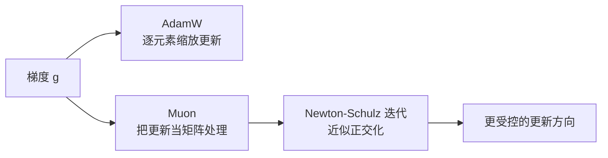
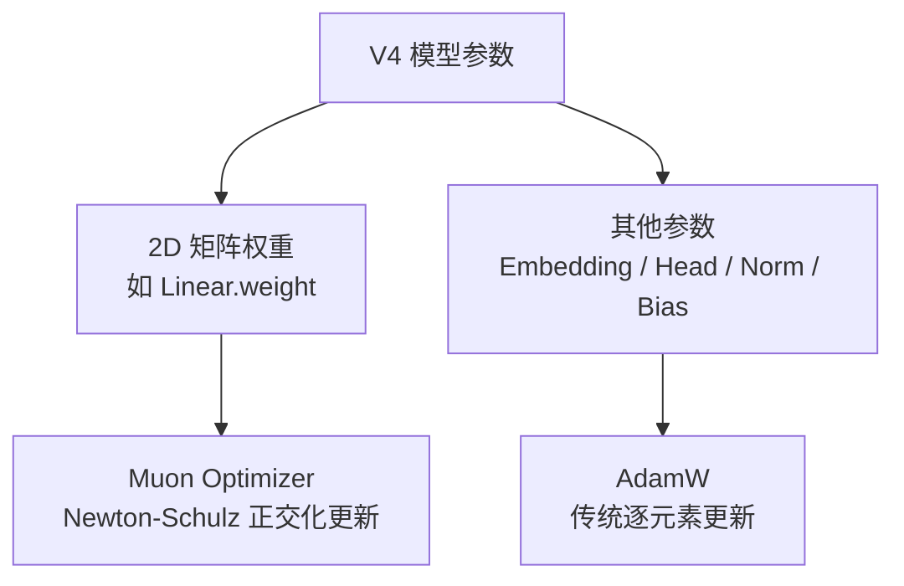

# 03. Muon：面向隐藏层矩阵参数的优化器

## 为什么 DeepSeek V4 会强调优化器

很多人在看大模型时更关注架构，但训练大模型时，优化器往往决定了两件非常现实的事情：

- 能不能稳定训起来
- 要花多少 token、多少算力才能收敛到目标效果

DeepSeek V4 官方说明里明确提到，它使用 `Muon optimizer` 来获得更快的收敛和更高的训练稳定性。

这意味着在 DeepSeek 看来，优化器不是训练阶段的附属品，而是核心创新的一部分。

## 一句话理解

`Muon` 不是给所有参数都一视同仁地做逐元素更新，而是特别针对隐藏层里的二维矩阵参数，利用"矩阵正交化"思想去更新它们。

## 它和 AdamW 最大的区别

传统的 `AdamW` 更像是：

- 把参数看成一堆标量
- 每个位置根据一阶、二阶统计量做逐元素调整

而 `Muon` 更像是：

- 把某些参数当成"一个整体矩阵"来看
- 更新时关心这个矩阵的方向结构，而不是只关心每个元素各自怎么变

所以它背后的直觉是：

> 对神经网络隐藏层权重来说，"矩阵整体形状"很重要，不能只做纯粹逐元素优化。

## Muon 的核心思路

根据 V4 技术报告和原始技术说明，`Muon` 主要用于神经网络隐藏层中的 `2D` 参数矩阵。
它的关键步骤是对更新做一种近似的正交化处理，实现上借助 **Newton-Schulz 迭代**。

### Newton-Schulz 迭代（概念）

```python
# 概念性伪代码
# 输入：梯度矩阵 G
# 目标：把更新方向正交化

X = G / G.norm()  # 归一化
for _ in range(iterations):
    # Newton-Schulz 迭代近似正交化
    X = 1.5 * X - 0.5 * X @ X.T @ X

# X 现在接近一个正交矩阵，用它作为更新方向
```

V4 中的具体实现使用了**两阶段系数**：

- **8 次快速收敛迭代**：使用激进系数快速逼近正交状态。
- **2 次稳定化迭代**：使用保守系数锁定稳定性，防止过度修正。

直觉上可以理解成：

1. 先得到普通梯度方向。
2. 把这个方向当成矩阵，而不是打散成很多标量。
3. 对这个矩阵更新做规范化/正交化，让更新更"几何合理"。

这样做的目标是让训练过程中：

- 更新方向更健康
- 不容易出现某些方向过度拉伸
- 在较大 batch、较大规模训练中保持效率

## 图解：AdamW 与 Muon 的差别



## 为什么"正交化更新"会有帮助

教学上可以这样理解：

- 如果一个矩阵更新在某些方向上特别强、某些方向上特别弱，训练可能不均衡。
- 正交化并不是让矩阵变成"没信息"，而是让更新更接近一种结构更良好的形态。

这通常有几个潜在好处：

- 提升训练稳定性
- 提高 token 利用效率
- 让更大的 batch 训练更划算

这也是为什么后来很多团队把 Muon 看成 AdamW 的潜在替代方向之一。

## DeepSeek V4 为什么会用它

DeepSeek V4 同时追求：

- 超大规模预训练（1.6T 总参数）
- 更复杂的新架构（CSA/HCA、mHC、MoE）
- 更好的训练效率

这三件事叠在一起时，优化器就会变得非常关键。
如果优化器不够稳，或者收敛太慢，那么再好的架构都很难把性价比做出来。

所以把 `Muon` 放进 DeepSeek V4，可以理解成两层目的：

1. 让训练更稳，减少大规模训练中的不确定性。
2. 让收敛更快，把同样的算力换成更高的最终能力。

## Muon 的适用边界

这项技术也不是一句"全面碾压 AdamW"就能概括的。
从公开资料看，`Muon` 有明显的使用边界：

- **用它**：隐藏层中的二维矩阵参数（如 Linear 层的 weight）。
- **不用它**：embedding 层、预测头、RMSNorm 权重、静态 bias、mHC gating 因子——这些继续用 AdamW。

这点很重要，因为它说明：

> `Muon` 更像一个"面向特定参数结构的专业优化器"，不是简单粗暴的一把梭。



## 理论支撑

arXiv 论文 "On the Convergence of Muon and Beyond"（arXiv:2509.15816）对 Muon 变体做了严格分析：

- 动量方差缩减版本（Muon-MVR2）可以达到最优的 **Õ(T^-1/3)** anytime 收敛率。
- 在 Polyak-Łojasiewicz (PL) 条件下，可以建立 best-iterate 收敛保证。

这意味着 Muon 不仅工程上好用，理论上也有收敛保障。

## 为什么它值得学

`Muon` 的学习价值很高，不只是因为 DeepSeek 在用，而是因为它代表了一种趋势：

- 未来优化器不一定继续停留在逐元素视角。
- 对矩阵、张量结构更敏感的优化方法，可能会在大模型训练里越来越重要。

换句话说，大家过去总在研究"网络该怎么设计"，而 `Muon` 提醒我们：

> 参数更新规则本身，也可以是模型能力和效率的重要来源。

## 小结

`Muon` 可以用一句话来记：

> 它把隐藏层权重当成矩阵来优化，并通过 Newton-Schulz 近似正交化让更新方向更稳定、更高效，因此特别适合大模型训练中对收敛速度和稳定性的追求。

这就是它会出现在 DeepSeek V4 这样的大规模系统里的原因。

## 参考资料

- 官方模型卡：[DeepSeek-V4-Pro](https://huggingface.co/deepseek-ai/DeepSeek-V4-Pro)
- 原始说明：[Muon: An optimizer for hidden layers in neural networks](https://kellerjordan.github.io/posts/muon/)
- 实现仓库：[KellerJordan/Muon](https://github.com/KellerJordan/Muon)
- 理论分析：[On the Convergence of Muon and Beyond](https://arxiv.org/abs/2509.15816)

## 补充说明

本文重点解释 `Muon` 的设计思想与使用场景，并补充了 V4 中 Newton-Schulz 的两阶段迭代策略；如果你后面想继续深挖，实现细节和参数分组策略值得单独再做一篇。
