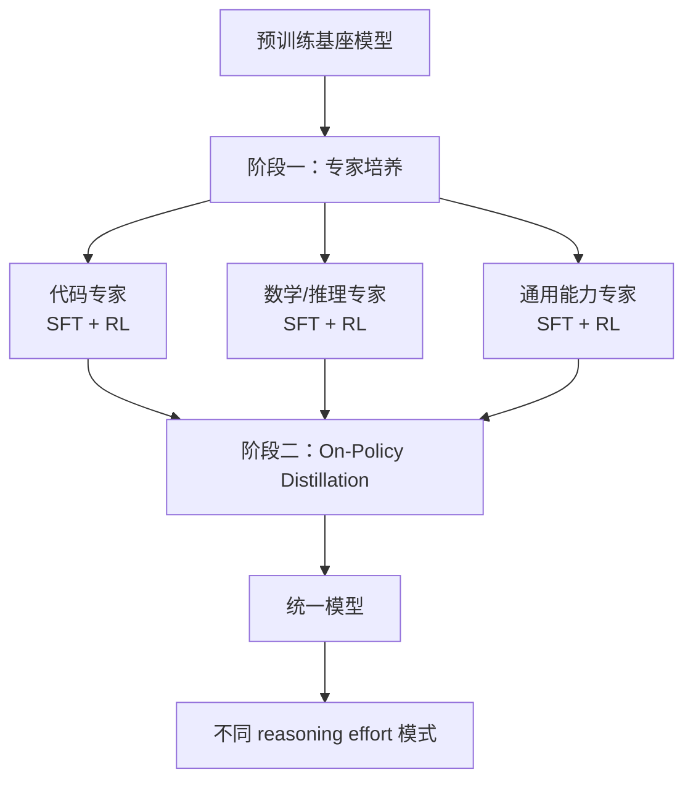
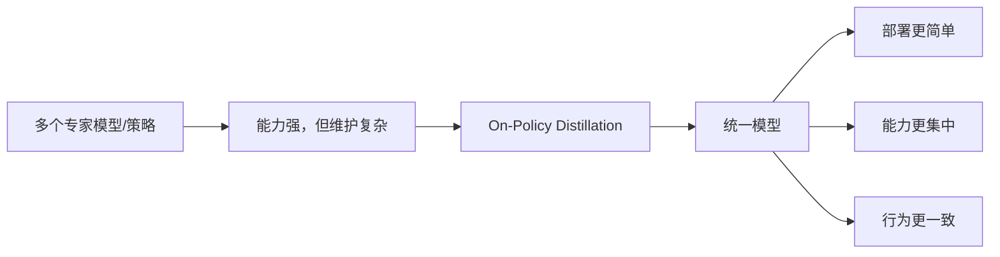

# 04. 两阶段后训练：专家培养与 On-Policy Distillation

## 为什么这部分很关键

很多人会把模型能力理解成“预训练出来的”，但现在强模型往往还依赖一套非常重的后训练流程。

DeepSeek V4 官方资料中，一个特别值得注意的点是：

> 它的 post-training 不是简单做一轮指令微调，而是采用两阶段范式。

官方描述可以概括成：

1. 先独立培养不同领域专家。
2. 再通过 `on-policy distillation` 把这些不同专长整合进统一模型。

## 一句话理解

先把数学、代码、通用推理等能力分别练成“专科医生”，再把这些专科经验回收并蒸馏到一个通用总模型中。

## 阶段一：独立培养领域专家

官方资料提到，这一阶段会通过：

- `SFT`
- `RL with GRPO`

来独立培养 domain-specific experts。

### 它在解决什么问题

不同能力往往需要不同训练偏好：

- 代码任务需要更强的执行严谨性和工具使用模式。
- 数学推理需要更长链条、更强一致性的思考过程。
- 通用对话和写作则关注风格、遵循性和广覆盖。

如果一开始就把所有东西混在一起训，常见问题是：

- 目标互相干扰
- 某些能力学得很快，另一些能力被冲淡
- 奖励信号不够清晰

所以更合理的做法是先分科培养。

## 阶段二：On-Policy Distillation

当多个专家已经各自练出强项后，问题变成：

> 怎样把这些分散在不同专家里的能力收敛到一个统一模型里？

DeepSeek V4 给出的答案是 `on-policy distillation`。

## 什么叫 on-policy

通俗理解就是：

- 不是只拿静态离线数据做蒸馏。
- 而是让当前策略在它真实会走到的轨迹上生成样本。
- 再用这些“模型当前会遇到的问题和行为分布”来做蒸馏与对齐。

这和纯离线蒸馏相比，通常更贴近模型部署时的真实行为分布。

## 图解：两阶段后训练流程

## 为什么这种流程比“全部混训”更强

### 1. 先局部最优，再全局整合

先训练专家，相当于允许每种能力先在更合适的目标下单独变强。  
等局部能力成熟以后，再做统一整合，通常比一开始就要求“什么都兼顾”更容易获得高峰表现。

### 2. 蒸馏的不只是答案，还有行为模式

`on-policy distillation` 的价值，在于它蒸馏的不是静态标签，而是更接近真实推理轨迹和策略分布的输出。

这有助于统一模型学到：

- 专家是怎么组织推理过程的
- 专家在自己擅长任务上如何分配计算预算
- 专家怎样避免常见错误

### 3. 更适合支持不同推理强度模式

官方还提到 DeepSeek V4 支持不同 `reasoning effort modes`。  
从训练逻辑上看，这和两阶段后训练是匹配的，因为：

- 专家阶段更容易把高质量推理模式训出来
- 统一蒸馏阶段更容易把这些模式收敛成可控的系统行为

## 这项技术背后的产品思维

这不只是训练技巧，也反映出一种产品思维：

- 用户希望一个模型既会写代码，又会推理，还能处理通用对话。
- 但这些能力的最佳训练方式并不相同。

所以更现实的方法不是强行“一锅炖”，而是：

1. 先让每种能力找到自己的最佳训练路径。
2. 再让系统学会统一调度这些能力。

这和组织管理里的“专家团队 + 总协调层”很像。

## 图解：为什么需要蒸馏回统一模型

## 你应该抓住的学习重点

如果以后看到类似方案，可以重点观察四件事：

1. 专家是按什么维度拆分的。
2. 各专家阶段分别用了什么监督和强化学习目标。
3. 蒸馏时是离线分布还是 on-policy 分布。
4. 最终统一模型是否真的保住了各专家的上限。

## 小结

DeepSeek V4 的后训练流程最重要的思想是：

> 不把“统一模型”当成起点，而是把它当成多个专家能力被整合后的结果。

先分科培养，再统一蒸馏，这是它把多领域强能力收回到单一模型里的关键路径。

## 参考资料

- 官方模型卡：[DeepSeek-V4-Pro](https://huggingface.co/deepseek-ai/DeepSeek-V4-Pro)

## 补充说明

公开可访问资料目前对该后训练流程的细节披露相对有限，本文重点解释其训练逻辑与工程意义；更细的奖励设计、数据构造和蒸馏损失形式，仍需以后续更完整技术报告为准。
