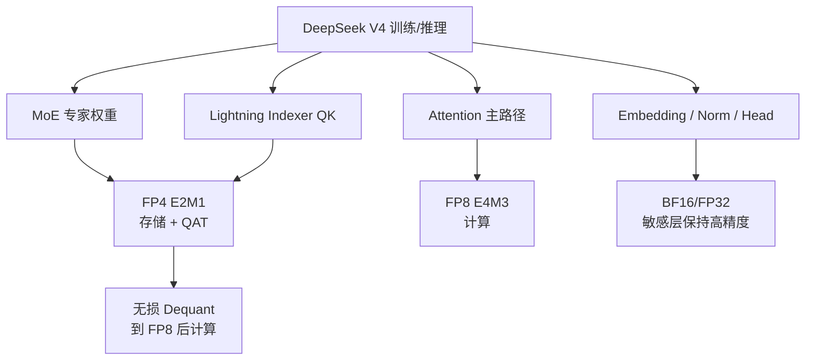

# 05. FP4 量化感知训练

## 这项技术想解决什么问题

大模型越来越大的一个直接后果是：训练和推理时的显存与带宽压力急剧上升。

DeepSeek V4 的总参数量达到 1.6T（Pro）/ 284B（Flash），其中 MoE 的专家权重占了绝大部分。如果能用更低的精度存储和传输这些权重，就能显著降低：

- 训练时的激活/权重内存占用
- 推理时的 KV Cache 和权重带宽
- 分布式训练时的通信量

但直接做推理时量化（Post-Training Quantization）往往会有精度损失。DeepSeek V4 的选择是 **FP4 量化感知训练（Quantization-Aware Training, QAT）**：在预训练阶段就直接让模型适应 FP4 精度。

## 一句话理解

在训练阶段就把大部分专家权重和索引器 QK 路径按 FP4 格式存储和计算，同时通过巧妙的格式设计让 FP4→FP8 转换**无损**，复用现有 FP8 训练 pipeline。

## 精度分配策略

V4 并没有一刀切全部用 FP4，而是做了精细分工：

| 精度 | 用途 |
|------|------|
| **FP4 (E2M1)** | MoE 专家权重（参数主体） |
| **FP4 (E2M1)** | CSA Lightning Indexer 的 QK 路径 |
| **FP8 (E4M3)** | 其他大部分参数和计算 |

这样做的理由是：专家权重数量巨大（总参数量主要由专家贡献），对它们做 FP4 收益最大；而 QK 路径做 FP4 可以进一步压缩索引器的内存带宽。

## 为什么 FP4→FP8 可以做到"无损"

这是 V4 FP4 方案中最精妙的一点。

FP4 采用的是 **E2M1** 格式（2 位指数，1 位尾数），而 FP8 采用 **E4M3** 格式（4 位指数，3 位尾数）。

关键观察：

- FP4 的指数范围比 FP8 小。
- 当把 FP4 的 block scale factor 吸收进 FP8 的表示时，**FP4 的精度可以完全保留在 FP8 中**。

换句话说：

> FP4 量化时的 block-wise scale 可以被 FP8 的额外指数位完全"吞下"，所以 dequantization 到 FP8 时没有信息丢失。

这意味着：

- 现有 FP8 训练框架**无需任何改动**就可以兼容 FP4 权重。
- 计算时先把 FP4 专家权重无损展开到 FP8，再在 FP8 精度下做矩阵乘。

## 带来的性能提升

根据 V4 技术报告，FP4 QAT 的效果包括：

| 指标 | 效果 |
|------|------|
| **Top-K 选择器速度** | **2x 加速** |
| **KV 条目召回率** | **99.7%** |
| **模型质量** | 与 BF16/FP8 baseline 相比无明显下降 |
| **训练 pipeline 改动** | **零改动**，直接复用 FP8 框架 |

## 为什么现在用 FP4 是合理的

有人可能会问：FP4 只有 2 位指数 1 位尾数，动态范围和精度都非常有限，为什么不会崩？

V4 的做法聪明之处在于：

1. **只对专家权重用 FP4**：MoE 的专家网络结构相对规则，且每个专家只处理部分 token，对极端精度的敏感度比 attention 等核心路径低。
2. **block-wise scaling**：不是全局一个 scale，而是分 block 做缩放，保留局部精度。
3. **QAT 而非 PTQ**：模型在训练过程中就学会了在 FP4 精度下表达知识，而不是先按高精度训练再硬截断。
4. **无损 dequantization 到 FP8**：实际计算时精度恢复到 FP8，避免了低精度矩阵乘的累积误差。

## 对未来硬件的意义

V4 技术报告中还提到一个前瞻性判断：

> 当前硬件上，FP4×FP8 的峰值 FLOPs 与 FP8×FP8 相同；但未来硬件（如下一代 NVIDIA B 系列）有望进一步释放 FP4 的效率优势，理论上可再提升约 **1/3**。

这意味着 V4 的 FP4 策略不仅是为现在的硬件省钱，也是为未来硬件提前做布局。

## 图解：V4 的混合精度全景

## 小结

FP4 量化感知训练在 DeepSeek V4 中不是"为了量化而量化"，而是整套效率工程的关键一环：

- 它让 **1.6T 参数** 的模型在推理和训练时的内存/带宽开销变得可接受。
- 它通过 **无损 dequantization 到 FP8** 避免了低精度带来的质量损失。
- 它**不需要改造现有 FP8 训练基础设施**，工程落地成本极低。
- 它为**未来支持 FP4 原生计算**的硬件提前铺好了路。

## 参考资料

- 官方模型卡：[DeepSeek-V4-Pro](https://huggingface.co/deepseek-ai/DeepSeek-V4-Pro)
- V4 技术报告：`DeepSeek_V4.pdf`
- FP4 训练研究：[Optimizing Large Language Model Training Using FP4 Quantization](https://arxiv.org/html/2501.17116v1)

## 补充说明

本文中的"无损"特指 FP4 block scale 可以被 FP8 表示完全吸收这一特定设计，不代表所有 FP4 量化都是无损的。V4 的具体 block size、量化粒度和动态范围选择仍以官方技术报告为准。
