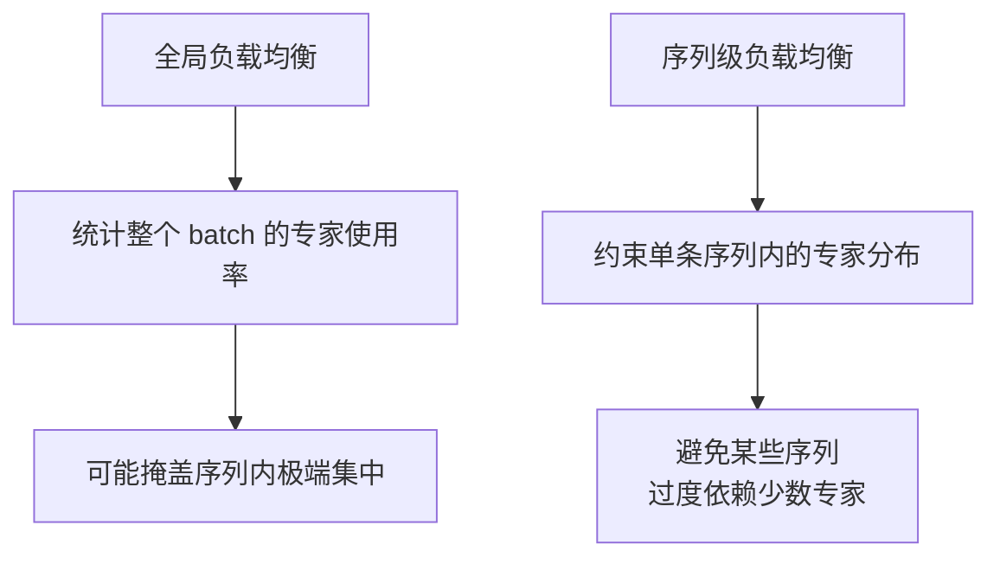
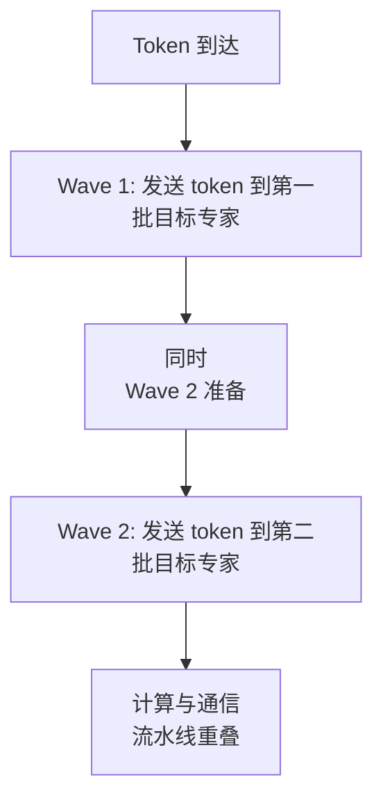
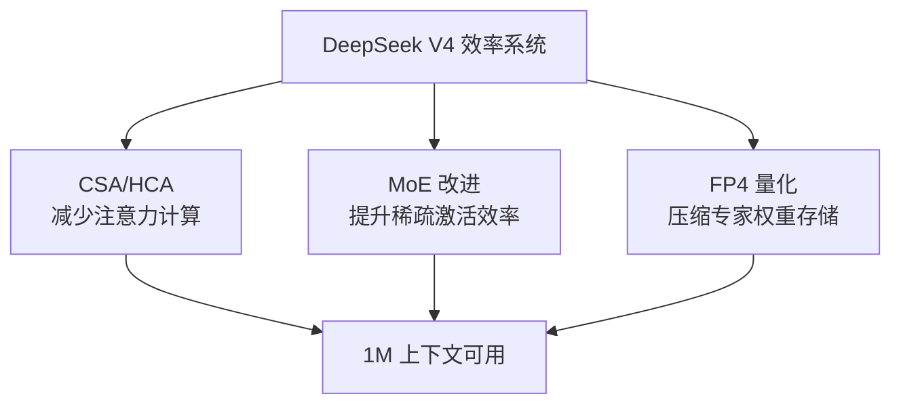

# 06. MoE 架构改进

## 为什么 MoE 值得单独讲

DeepSeek V4 的总参数量虽然达到 1.6T（Pro）/ 284B（Flash），但每 token 只激活约 49B / 13B。这种"稀疏激活"的核心就是 **Mixture-of-Experts（MoE）**。

不过，MoE 本身并不是新东西。V4 值得学习的地方在于：它在 V3 的基础上做了一系列**结构级改进**，让稀疏路由更高效、更稳定、更适合长上下文场景。

## 一句话理解

V4 的 MoE 不只是"堆更多专家"，而是从激活函数、负载均衡、早期层设计、通信策略多个维度做了针对性升级。

## 基础结构：256 专家，Top-8 路由

先确认基本参数：

| 参数 | V4-Pro | V4-Flash |
|------|--------|----------|
| 专家总数 | 256 | 256 |
| 每 token 激活专家数 | 8 | 8 |
| 激活比例 | ~3.1% | ~3.1% |

这意味着每个 token 只走 8 个专家，计算量被严格控制。

## 改进一：Hash-routed MoE 替代早期 Dense FFN

传统 Transformer 的前几层通常用 Dense FFN（每个 token 走同一个前馈网络）。V4 的一个变化是：

> 早期层改用 **Hash-routed MoE** 替代 Dense FFN。

### 为什么前几层特别

- 浅层负责提取基础特征（词法、局部语法）。
- 这些特征相对固定，不太需要复杂的门控路由决策。
- Hash 路由是 O(1) 的确定性映射，比学习型 top-k 路由更轻量。

### Hash-routed MoE 的工作方式


好处是：

- 省了门控网络（gating network）的计算。
- 路由决策完全确定，没有负载不均衡问题。
- 适合浅层这种"特征提取相对通用"的场景。

## 改进二：激活函数改为 Sqrt(Softplus())

V3 中专家亲和度（expert affinity score）的计算通常用 Sigmoid。V4 改成了：

```
score = sqrt(softplus(x))
```

### 这个改动想解决什么

Softplus 比 ReLU/Sigmoid 更平滑，在 0 附近没有硬截断；外面套一个 sqrt 是为了：

- 抑制极端大值（让分数分布更集中）。
- 保持非线性表达能力的同时，让路由决策更稳定。
- 避免某些专家被过度激活或完全闲置。

## 改进三：序列级负载均衡损失

MoE 的经典难题是**负载不均衡**：某些专家被大量 token 选中，另一些专家几乎闲置。

V3 已经有负载均衡机制，V4 在此基础上增加了 **sequence-level balance loss**：

- 不只是全局统计专家使用率。
- 而是在**单个序列内部**也做负载均衡约束。

### 为什么序列级很重要



长上下文场景下，单条序列可能非常长（甚至达到 1M tokens）。如果只做全局均衡，可能出现：

- 某些长序列把所有计算都砸向少数几个专家。
- 这些专家的显存和计算瞬间被占满，造成局部瓶颈。

序列级平衡损失让负载更均匀地分散到不同专家上。

## 改进四：移除节点限制

V3 的专家路由可能对目标节点（node）有一些限制。V4 的改动是：

> **移除节点限制**（removed node restriction limits on routing targets）。

这意味着路由决策可以更自由地选择专家，不受物理节点布局的约束。

好处：

- 专家选择的灵活性更高。
- 更容易达到理论上的最优负载分布。

代价：

- 跨节点通信可能增加，需要更好的通信-计算重叠策略来掩盖。

## 改进五：细粒度专家并行与通信重叠

V4 采用 **fine-grained expert parallelism**，把专家切分成多个 waves 来隐藏通信延迟：



这让 MoE 的 all-to-all 通信不再是明显的瓶颈。

## MoE 改进的整体效果

这些改动叠加在一起，让 V4 的 MoE 比 V3 更高效：

| 方面 | V4 改进 |
|------|---------|
| 早期层效率 | Hash-routed MoE 省掉门控计算 |
| 路由稳定性 | Sqrt(Softplus) 让分数分布更稳 |
| 负载均衡 | 序列级平衡减少局部热点 |
| 路由自由度 | 移除节点限制，选择更优 |
| 通信效率 | 细粒度 waves + 重叠隐藏延迟 |

## 与 CSA/HCA 的协同

MoE 改进和混合注意力不是孤立的，它们相互支撑：

- **CSA 的 Lightning Indexer** 做 top-k 选择时，本身就是另一种"稀疏选择"，和 MoE 的 top-8 路由在工程优化上有共通之处。
- **长上下文意味着更多 tokens** 同时过 MoE 层，负载均衡做不好会直接放大延迟。
- **FP4 主要压缩的就是专家权重**，MoE 效率越高，FP4 的收益面越大。



## 小结

DeepSeek V4 的 MoE 改进说明：

> 稀疏激活不只是"参数越多越好"，路由策略、负载均衡、通信效率和精度压缩之间的系统性配合，才是让大 MoE 模型真正跑起来的关键。

## 参考资料

- 官方模型卡：[DeepSeek-V4-Pro](https://huggingface.co/deepseek-ai/DeepSeek-V4-Pro)
- V4 技术报告：`DeepSeek_V4.pdf`
- DeepSeek V3 论文（对比参考）：了解 V3 的原始 MoE 设计

## 补充说明

本文对 Hash-routed MoE 的具体 hash 函数形式、序列级平衡损失的精确数学形式、以及 expert parallelism 的 wave 切分策略，做了基于公开描述的教学化整理；具体实现细节以官方技术报告和开源代码为准。
