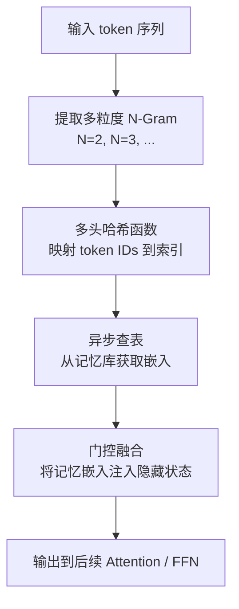
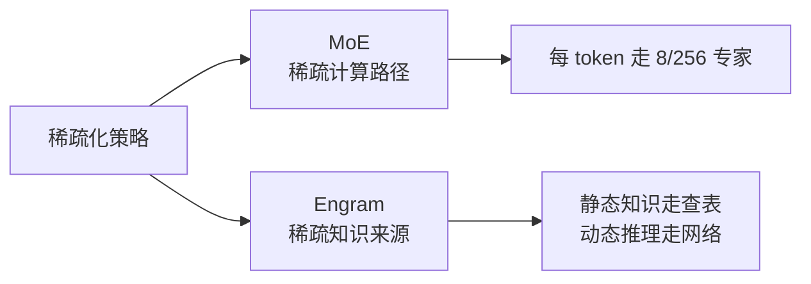
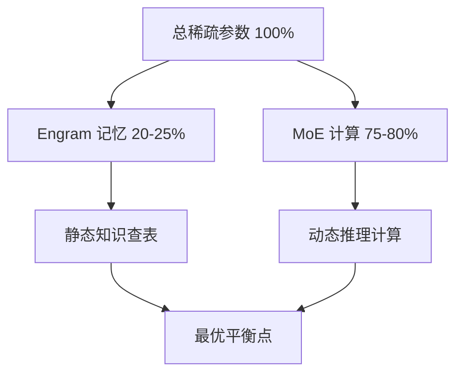
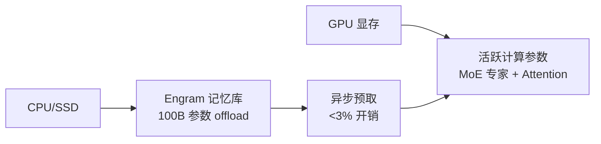

# 07. Engram 条件记忆（同期研究）

## 重要前置说明

在开始学习之前，需要先澄清一件事：

> **Engram 条件记忆目前并未被 DeepSeek V4 官方 model card 或技术报告明确确认已集成。** 它来自 DeepSeek 与北京大学同期发表的研究论文 "Conditional Memory via Scalable Lookup: A New Axis of Sparsity for Large Language Models"（作者包含梁文锋）。

本文将其纳入学习手册，是因为它在技术路线和时间点上与 V4 高度相关，且代表了 DeepSeek 在"记忆机制"方向上的重要探索。你可以把它理解为：

- **已确认**：这是 DeepSeek 团队发表的真实研究，有实验数据支撑。
- **待确认**：它是否以完整形式存在于 V4 的最终版本中，官方尚未给出最终定论。

## 这项技术想解决什么问题

MoE 的核心思想是"稀疏计算"：不是所有参数都参与每个 token 的计算。但 MoE 仍然有局限：

- 即使是"静态知识"（如实体名称、API 签名、固定短语），MoE 也要走一遍门控+专家前向传播。
- 很多 token 其实只需要"查表"就能解决，不需要复杂的矩阵变换。

Engram 想回答的问题是：

> 能不能把"静态知识查找"从"动态推理计算"中彻底解耦，用 O(1) 查表代替部分专家计算？

## 一句话理解

Engram 是一个**条件记忆模块**：它从输入中提取 N-Gram，通过哈希映射直接查表获取预存嵌入，再用门控机制融合到隐藏状态中，从而用查表替代部分计算。

## Engram 的工作流程



### 1. 多粒度 N-Gram 提取

不是只看单个 token，而是提取连续的 token 片段：

- bi-gram（2-gram）
- tri-gram（3-gram）
- 更高阶 N-gram

这捕捉了比单 token 更丰富的局部模式。

### 2. 多头哈希映射

使用**多组独立的哈希函数**把 N-Gram 映射到记忆库的索引位置。

- 多头的目的是减少哈希碰撞。
- 哈希只依赖输入 token IDs，**不依赖中间激活值**。

这一点非常关键，因为它意味着：

> 查表操作可以完全异步化，甚至提前预取。

### 3. 记忆库查表

记忆库本质上是一个巨大的嵌入表（embedding table），存储了预训练的 N-Gram 嵌入。

查表复杂度是 **O(1)**，和序列长度、模型深度无关。

### 4. 门控融合

查到的记忆嵌入不会直接替换隐藏状态，而是通过一个**可学习的门控**（gating mechanism）来决定融合比例：

```text
h_out = h_in + gate * memory_embedding
```

这让模型可以灵活决定：

- 什么时候依赖记忆（查表就够了）。
- 什么时候需要忽略记忆（继续走正常 FFN/Attention）。

## 为什么这叫"新的稀疏轴"

传统 MoE 的稀疏是在"专家维度"上：每个 token 只走少数几个专家。

Engram 提出的是另一个维度的稀疏：

| 稀疏维度 | MoE | Engram |
|----------|-----|--------|
| 稀疏对象 | 计算路径（专家） | 知识来源（记忆查表 vs 网络计算） |
| 决策依据 | 门控网络看激活 | 哈希函数看输入 token IDs |
| 复杂度 | O(1) 路由 + O(d) 专家计算 | O(1) 查表 |
| 参数规模 | 专家权重通常留在 GPU | 记忆库可 offload 到 CPU/SSD |



## 稀疏分配定律（Sparsity Allocation Law）

Engram 论文中最有趣的发现之一是：

> 在总稀疏参数量固定时，**20-25% 分配给记忆（Engram），75-80% 分配给计算（MoE）**，能达到最优性能。

这是一个**U 型曲线**：

- 记忆太少：静态知识仍然被浪费计算。
- 记忆太多：动态推理能力被挤占，且记忆库本身也会浪费参数。
- 中间某处：两者互补效果最好。

实验显示，一个 **27B 参数的 Engram-MoE 混合模型** 在 MMLU、BBH、HumanEval 和多查询检索任务上，超过了纯 MoE baseline。



## 可 offload 的巨大优势

因为 Engram 的查表只依赖输入 token IDs（不依赖激活），它有一个 MoE 不具备的特性：

> **记忆库可以完全放在 CPU/SSD 上，通过异步预取加载到 GPU。**

论文中的数据：

- 可以 offload 多达 **1000 亿参数** 的记忆库到 CPU/SSD。
- 推理开销增加 **< 3%**。

这在工程上的意义非常大：

- 它打破了"模型参数必须全部塞进 GPU 显存"的约束。
- 让"超大规模静态知识"的存储成本显著下降。



## 和 V4 的关联与区别

| 方面 | V4 已确认 | Engram（相关研究） |
|------|-----------|-------------------|
| 是否官方确认集成 | **是** | **未明确确认** |
| 处理长上下文 | CSA + HCA | O(1) 查表，不随长度增长 |
| 稀疏化思路 | 专家维度稀疏 | 知识来源维度稀疏 |
| 内存卸载 | 未披露 | 1000 亿参数可 offload |
| 发布时间 | 2026-04-24 | 同期研究 |

## 这项技术的新意

Engram 的价值不仅在于它本身，更在于它提出了一种新的思考框架：

### 1. "不是所有知识都需要计算"

大模型通常把"知识存储"和"知识处理"混在一起（都靠权重矩阵）。Engram 把它们拆开：

- 常见、静态的知识 → 直接查表。
- 复杂、动态的推理 → 走神经网络。

### 2. 稀疏可以发生在多个维度

MoE 稀疏的是"谁来计算"，Engram 稀疏的是"知识从哪里来"。两者是正交的，可以叠加。

### 3. 为超长上下文和超大记忆提供新思路

如果未来模型需要记住整个互联网，Engram 的 offload 能力可能是关键基础设施。

## 小结

Engram 条件记忆可以一句话概括：

> 它尝试用 O(1) 的哈希查表来替代部分静态知识的前向计算，并把记忆库从 GPU 显存中解放出来，是对 MoE"稀疏计算"思路在"知识来源"维度上的自然延伸。

无论它最终是否完整集成进 V4，这个方向都值得持续跟踪。

## 参考资料

- Engram 研究论文："Conditional Memory via Scalable Lookup: A New Axis of Sparsity for Large Language Models"（DeepSeek + 北京大学）
- 相关分析：[DeepSeek Engram: V4 Architecture Revealed?](https://deepseek.ai/blog/deepseek-engram-v4-architecture)
- 官方 V4 model card（注意未明确提及 Engram）：[DeepSeek-V4-Pro](https://huggingface.co/deepseek-ai/DeepSeek-V4-Pro)

## 补充说明

本文对 Engram 的介绍基于其公开发表的研究论文及相关技术博客。由于 DeepSeek V4 官方技术报告和 model card 未明确确认该技术已完整集成，读者在引用时应注意区分"V4 已确认技术"和"同期相关研究"。
