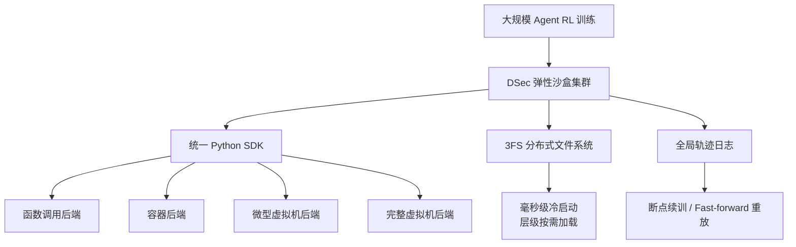
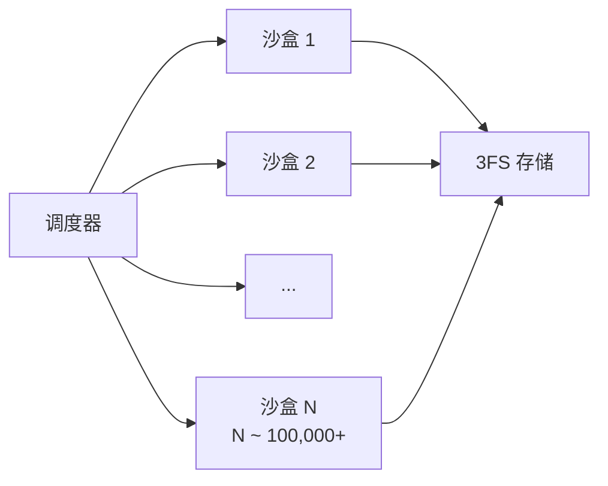
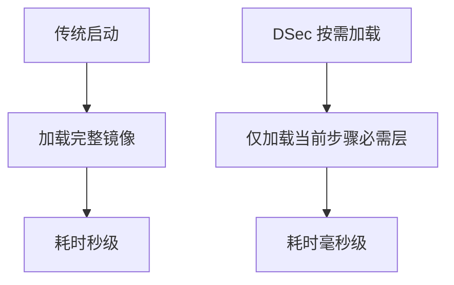
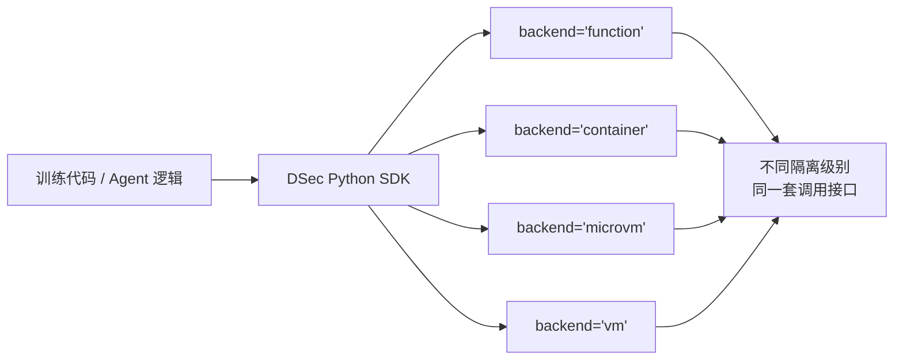
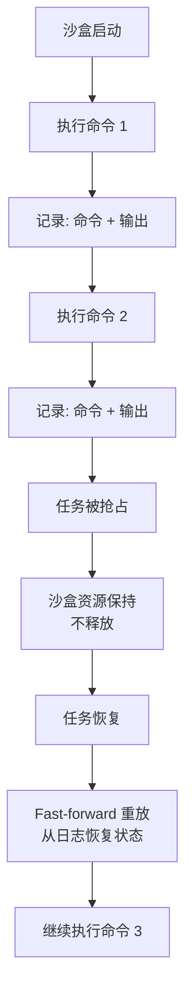
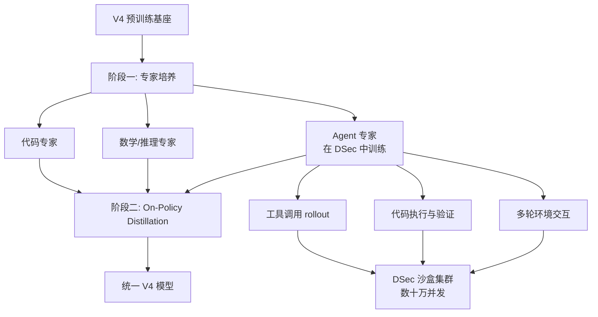

# 08. DSec：面向大规模 Agent 训练的弹性计算沙盒

## 为什么需要专门讲 DSec

前面几篇讲的都是模型"内部"的技术：注意力怎么算、权重怎么更新、专家怎么路由。但训练一个强 Agent 模型，光有模型架构不够——你还需要一个**足够大、足够快、足够稳定**的外部执行环境，让模型能在里面试错、调用工具、写代码、做推理。

DeepSeek V4 的 DSec（DeepSeek Elastic Compute）就是干这个的。它不是模型的一部分，而是**支撑模型变成 Agent 的训练基础设施**。

## 一句话理解

DSec 是一个用 Rust 写的生产级弹性沙盒系统，单集群能同时跑**数十万个并发沙盒**，统一抽象了函数/容器/虚拟机四种执行底座，并通过**全局轨迹日志**实现任务抢占后的断点续训，专门服务于大规模 Agent 强化学习。

## 核心定位：从"实验级"到"生产级"

训练 Agent 模型和训练聊天模型有一个本质区别：

| | 聊天模型 | Agent 模型 |
|--|---------|-----------|
| 训练数据 | 静态语料（对话、文档） | 动态交互（工具调用、代码执行、环境反馈） |
| 执行环境 | 基本不需要 | 必须高保真、可复现 |
| 容错要求 | 低 | 极高（代码执行不可随便重试） |
| 并发规模 | 数据并行即可 | 需要环境级并行（每个 rollout 一个独立环境） |

DSec 解决的就是：

> 当需要同时运行十万个 Agent rollout，每个都在写文件、调 API、跑代码时，怎么保证环境隔离、快速启动、以及任务被抢占后还能恢复？

## 架构总览

## 核心技术特征

### 1. 超大规模并发：单集群数十万个沙盒

Agent 强化学习通常需要海量的并行 rollout 来收集经验。DSec 的设计目标之一是：

> **单集群同时调度数十万个并发沙盒。**

这需要的不是简单的"多开 Docker"，而是整个调度链路的重构：

- 沙盒创建/销毁必须极轻量。
- 资源调度需要精细到 sub-second 级别。
- 存储层必须支持海量小文件的随机读写。

DSec 选择用 **Rust** 实现核心系统，并对接自研的 **3FS 分布式文件系统**，在性能和控制力之间取得平衡。

### 2. 毫秒级冷启动：层级按需加载

沙盒的致命瓶颈往往是"冷启动"：如果每次 rollout 都要从一个完整 VM 镜像启动，十万个并发意味着灾难。

DSec 的解决方案是 **hierarchical on-demand loading（层级按需加载）**：

- 不是一次性加载完整环境。
- 而是按层级、按需求逐步加载必要的依赖和文件。
- 类似操作系统里的 demand paging，但粒度更粗、针对沙盒镜像优化。

效果：把沙盒启动时间从"秒级"压到**毫秒级**，让大规模并发的可行性从"理论上可以"变成"工程上可行"。

### 3. 统一四种异构执行底座

不同的 Agent 任务对执行环境的安全隔离级别要求不同：

| 后端类型 | 隔离级别 | 启动速度 | 适用场景 |
|----------|---------|----------|----------|
| **函数调用** | 进程级 | 最快 | 简单工具调用、计算器、查询 |
| **容器（Container）** | 内核命名空间 | 快 | 代码执行、文件操作 |
| **微型虚拟机（MicroVM）** | 硬件虚拟化 | 中等 | 需要更强隔离的代码运行 |
| **完整虚拟机（VM）** | 完整系统虚拟化 | 较慢 | 复杂多步骤任务、完整 OS 环境 |

DSec 的关键设计是：**一套统一的 Python SDK，四种后端对上层完全透明。**

切换后端时，训练代码几乎不用改，只需改一个配置参数。

这意味着：

- 初期实验可以用轻量的函数调用快速迭代。
- 需要跑不可信代码时切到 MicroVM/VM。
- 整个切换过程对训练框架透明。

## 面向 Agent 训练的容错设计

Agent 强化学习有一个棘手的工程问题：**任务抢占**。

在大型集群里，训练任务经常因为资源调度、优先级调整、节点故障等原因被中断。对于普通的深度学习训练，checkpoint + resume 就能解决。但对于 Agent 训练：

- Agent 可能已经执行了多轮工具调用。
- 某些操作是**非幂等**的：写文件、发请求、改数据库。
- 如果简单粗暴地"重新执行一遍"，环境状态会变，导致轨迹不一致。

DSec 的解决方案是 **全局轨迹日志（Global Trajectory Log）**：

### 工作方式

### 三个关键机制

1. **全局有序日志**：每个沙盒维护一份精确有序的 command-output 记录。
2. **资源保持**：任务被抢占后，沙盒本身不销毁，环境状态被冻结保留。
3. **Fast-forward 重放**：任务恢复时，系统从日志中"快进"重放已执行的命令结果，而不是实际重新执行。

### 为什么这很重要

> 它避免了非幂等操作的重复执行错误，保障了强化学习训练的**一致性**和**可复现性**。

没有这套机制，一个涉及 20 步工具调用的 Agent rollout 被抢占了，恢复时可能因为第 5 步的写操作被重复执行而导致整个后续轨迹失效。

## DSec 与 V4 后训练流程的衔接

DSec 不是独立存在的玩具，它是 V4 Agent 能力的训练底座：

具体来说：

### 1. 支撑 Agent 专家的 GRPO 训练

V4 的 Agent 专家阶段使用 **GRPO（Group Relative Policy Optimization）** 强化学习。这需要：

- 策略模型生成一组 action 轨迹。
- 在真实环境中执行这些 action，拿到 reward。
- 根据相对表现更新策略。

DSec 提供了"真实环境"的可扩展版本：每个 rollout 一个沙盒，十万个 rollout 同时跑。

### 2. 支撑大规模数据合成

类似 V3.2 中提到的自动环境合成管线（1800+ 任务环境、85000+ 复杂指令），DSec 让这种"难解答、易验证"的 Agent 任务可以被大规模生成和验证。

### 3. 支撑自动化评测

Agent 能力的评测不能靠选择题，必须真的让模型去执行。DSec 同时也是 V4 Agent 评测的基础设施，覆盖代码修复、终端操作、搜索规划等多类任务。

## DSec 的工程启示

从学习角度，DSec 带来的最大启发是：

> **Agent 模型的核心竞争力，不只在于模型本身，还在于"模型能在多大规模、多高保真度的环境中试错"。**

换句话说：

- 没有 DSec，V4 的 Agent 能力可能只能在实验室小规模验证。
- 有了 DSec，V4 可以在生产级规模下进行 Agent 强化学习，这才是它能真正"会用工具"的关键原因之一。

这也解释了为什么 DeepSeek 把 DSec 和模型一起放在技术报告里讲——在他们看来，**训练基础设施本身就是模型能力的一部分**。

## 小结

DSec 可以用一句话概括：

> 它是让大规模 Agent 强化学习从"论文概念"变成"工程现实"的沙盒操作系统，通过统一异构底座、毫秒级冷启动和轨迹日志容错，解决了"十万个 Agent 同时试错"的核心工程难题。

## 参考资料

- 官方模型卡：[DeepSeek-V4-Pro](https://huggingface.co/deepseek-ai/DeepSeek-V4-Pro)
- V4 技术报告：`DeepSeek_V4.pdf`
- 相关解读：[DeepSeek V4 Launches Advanced Elastic Computing Sandbox DSec](https://phemex.com/news/article/deepseek-v4-launches-advanced-elastic-computing-sandbox-dsec-75630)
- 相关解读：[单集群调度数十万并发，统一四种异构底座 - MetaEra](https://www.metaera.hk/news/273779)

## 补充说明

本文对 DSec 的描述基于 V4 技术报告及相关技术解读中的公开信息。DSec 目前未以独立开源项目形式发布，其内部调度算法、3FS 集成细节和轨迹日志的具体存储格式，仍需以官方后续披露为准。
